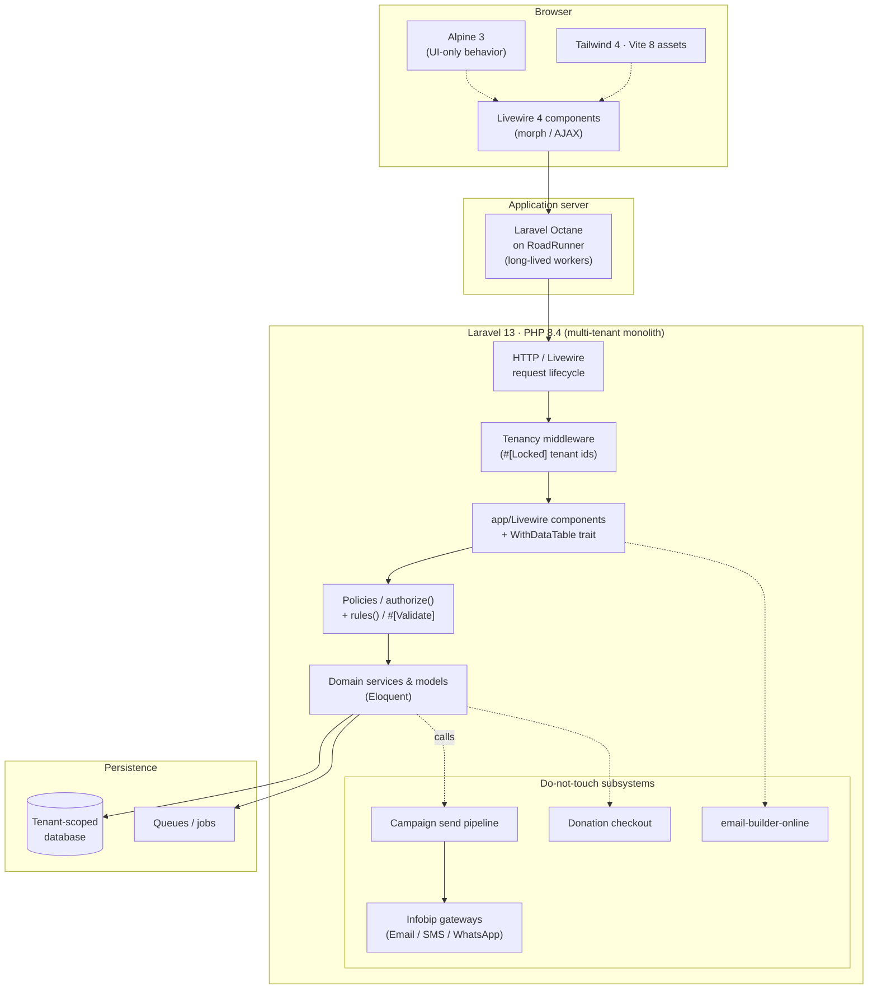
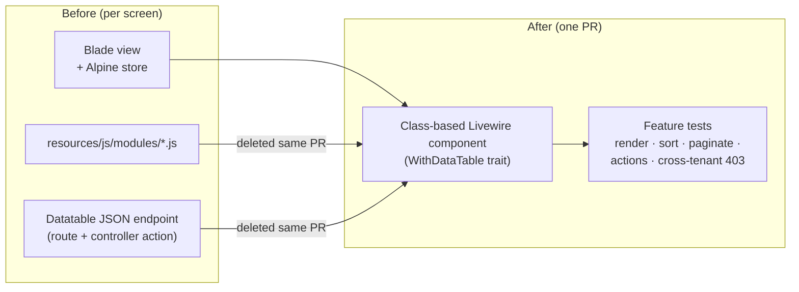

# Maildrill

A professional workspace for creating, delivering, and analyzing multi-channel
messaging campaigns (email, SMS, WhatsApp). Built to feel like **Linear meets
Resend** — fast, calm, and minimal — not like an admin panel.

> "The fastest professional workspace to create, deliver and analyze campaigns."

- **Product overview:** [`PRODUCT.md`](PRODUCT.md)
- **Design system & UX spec:** [`DESIGN.md`](DESIGN.md)
- **AI agent operating manual:** [`AGENTS.md`](AGENTS.md) · Claude Code:
  [`CLAUDE.md`](CLAUDE.md)

---

## Tech stack

| Layer           | Technology                                 |
| --------------- | ------------------------------------------ |
| Language        | PHP 8.4                                    |
| Framework       | Laravel 13 (multi-tenant monolith)         |
| Runtime         | Laravel Octane on RoadRunner               |
| Interactive UI  | Livewire 4.3 (class-based, `app/Livewire`) |
| Client behavior | Alpine 3 (UI-only)                         |
| Styling         | Tailwind 4                                 |
| Build           | Vite 8 + pnpm                              |
| Tests           | PHPUnit 13                                 |

> Codebase is ground truth: if a doc disagrees with `composer.json` /
> `package.json`, the manifest wins.

---

## Getting started

```bash
# 1. Install dependencies
composer install
pnpm install

# 2. Environment
cp .env.example .env
php artisan key:generate

# 3. Database
php artisan migrate --seed

# 4. Build assets
pnpm run dev            # or: pnpm run build

# 5. Serve (Octane / RoadRunner)
php artisan octane:start --watch
```

Then open the app at the URL Octane reports (default `http://localhost:8000`).

---

## Common commands

```bash
# Tests (prefer a filtered run while iterating)
vendor/bin/phpunit
vendor/bin/phpunit --filter <TestName>

# Code style (changed files only)
vendor/bin/pint --dirty

# Frontend quality gates
pnpm run lint
pnpm run typecheck
pnpm run build

# Scaffolding
php artisan make:livewire <Namespace/Component>
```

---

## Architecture notes

- **Multi-tenant.** Tenant identifiers are locked (`#[Locked]`) on Livewire
  components; every action validates + authorizes and is covered by a
  cross-tenant 403 test.
- **Octane / RoadRunner.** Workers are long-lived — avoid leaking request state
  through static properties or singletons.
- **Livewire 4 migration.** Legacy Blade + Alpine-store screens (with datatable
  JSON endpoints and `resources/js/modules/*.js`) are being migrated to
  class-based Livewire components using the shared `WithDataTable` trait. See
  [`docs/migration/MIGRATION_PLAN.md`](docs/migration/MIGRATION_PLAN.md). Each PR
  migrates one slice and deletes the code it replaces.
- **Islands** (`wire:poll.visible`) are used for polling / expensive regions;
  loops carry `wire:key`; loading states use `data-loading` / `wire:loading`.

### System diagram



**Migration flow** — legacy screens are converted one slice at a time:



---

## Contributing

- **One slice per PR.** Keep diffs scoped; delete replaced JS modules, their
  `app.js` imports, and the old datatable endpoints in the same PR.
- Reuse existing Blade components; check sibling files before creating anything;
  preserve the existing markup and Tailwind look.
- Every Livewire action: `rules()`/`#[Validate]` **and** `$this->authorize()`.
- Ship feature tests (`Livewire::test`, model factories) for render,
  search/sort/paginate, each action's happy + failure path, and authorization.
- No dependency changes, no reformat-only diffs, no new throwaway scripts.
- Do **not** touch: the campaign send pipeline, Infobip gateways, donation public
  checkout, email-builder-online internals, or auth views.

Before opening a PR:

```bash
vendor/bin/phpunit --filter <RelevantTest>
vendor/bin/pint --dirty
pnpm run lint
pnpm run typecheck
```
