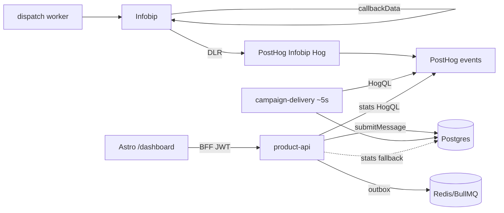

# Maildrill backend handoff (`workers/`)

**Audience:** engineers / agents picking up the messaging + product backend.  
**Location:** `web-maildrill-astro/workers/` (npm package name still `workers`).  
**Formerly:** standalone repo `/Users/secret/Code/workers` — nested `.git` removed; this tree is part of the Astro monorepo.  
**Last updated:** 2026-07-31

---

## 1. What lives where

| Path                             | Role                                                                                        |
| -------------------------------- | ------------------------------------------------------------------------------------------- |
| Repo root `web-maildrill-astro/` | Marketing site + `/dashboard` workspace UI (Astro 7 + React 19 islands) + BFF (`/api/v1/*`) |
| `workers/`                       | Fastify messaging API, product API, email-builder AI API, BullMQ workers, Drizzle/Postgres  |
| Root `packages/*`                | Vendored email visual editor only (not the Node backend)                                    |
| Root `.env`                      | **Single** env file for Astro **and** workers (`workers/packages/config` loads `../.env`)   |

`workers/` is included in the **root** `pnpm-workspace.yaml` (`workers`,
`workers/packages/*`, `workers/apps/*`). One `pnpm install` at the repo root
installs frontend + backend. Do **not** recreate a nested `workers/pnpm-workspace.yaml`.

```
web-maildrill-astro/
  .env / .env.example          # shared secrets
  src/ …                       # Astro frontend + BFF
  packages/email-builder-*     # vendored editor
  workers/                     # THIS backend
    apps/
      api/                     # messaging + webhooks (:3002 alone)
      product-api/             # product CRUD + stats (:3001 alone)
      email-builder-api/       # AI / Unsplash (:3003 alone)
      workers/                 # BullMQ role processes
      dev-server/              # unified local process (HTTP + workers on :3001)
    packages/
      config database domain services product providers …
    docs/                      # ARCHITECTURE, Infobip, PostHog Hog
```

Canonical product overview: [`../docs/PRODUCT.md`](../docs/PRODUCT.md). Agent rules: [`../docs/AGENTS.md`](../docs/AGENTS.md).

---

## 2. How to run locally

From **repo root**:

```bash
cp .env.example .env          # once; fill secrets
pnpm install                  # Astro + workers (one workspace)
pnpm --dir workers db:up      # Postgres + Redis via docker compose (optional)
pnpm --dir workers db:migrate
pnpm dev:all                  # product :3001 · messaging :3002 · EB :3003 · workers, then Astro :4321
```

Or separately:

```bash
pnpm --filter workers dev   # unified Fastify on PRODUCT_API_PORT (default 3001)
# same as: pnpm --dir workers dev
pnpm dev                              # Astro only
```

`pnpm dev:all` sets `API_BASE_URL` / `MESSAGING_API_BASE_URL` / `EB_API_BASE_URL` for Astro.
With unified `pnpm --filter workers dev`, leave those unset (or point `API_BASE_URL` at `:3001`).
`JWT_SECRET` must match between Astro BFF and workers.

Docker / Ploi split: `start:api`, `start:product-api`, `start:email-builder-api`, `worker all`.

---

## 3. Locked architecture (delivery + analytics)

### 3.1 Infobip notify targets

| Infobip notify          | Destination                               |
| ----------------------- | ----------------------------------------- |
| Delivery / seen / voice | **PostHog only** (incoming webhook + Hog) |
| Template status         | **PostHog only** (`?kind=template`)       |

Maildrill `/webhooks/infobip/{delivery|engagement|voice}` routes **remain in code** but must **not** be configured in Infobip. Product DLR truth is the **campaign-delivery poller**, not live Infobip→Maildrill webhooks.

PostHog webhook (Maildrill project `526344`):

```
https://webhooks.us.posthog.com/public/webhooks/019f9251-bee2-0000-231d-064eff754e26?kind=delivery
```

Kinds: `delivery` → `message_delivery_report`, `engagement` → `message_seen_report`,
`tracking` → `message_tracking_report` (open/click/unsub/complaint), `voice` →
`message_voice_report`, `template` → `whatsapp_template_status`.

Details + Hog source: [`docs/posthog-infobip-hog.md`](docs/posthog-infobip-hog.md), [`docs/posthog-infobip.hog`](docs/posthog-infobip.hog).

### 3.2 Tenancy on DLRs (`callbackData`)

Outbound Infobip sends stamp:

```
{tenantId}|{channel}|{maildrillMessageId}
```

Hog parses into `properties.tenant_id`, `channel`, `maildrill_message_id`. Without this, HogQL tenant charts and the delivery poller cannot match rows.

Implementation: `packages/providers/src/infobip.ts` → `callbackData()`.

### 3.3 Campaign lifecycle

1. `sendCampaign` claims the row → queues messages → leaves status **`sending`** (not `sent`).
2. Empty audience (`queued === 0`) → immediate **`sent`**.
3. Worker role **`campaign-delivery`** (under `worker all` and the unified `dev`/`start` server) every `CAMPAIGN_DELIVERY_POLL_INTERVAL_MS` (default **5s**):
   - Loads open messages (`queued|processing|submitted|sent`), campaign and one-off.
   - HogQL: latest `status_group` per `maildrill_message_id` (delivery + voice).
   - Applies outcomes via `applyProviderOutcome` / `resolveEventTransition`.
   - Also syncs `message_seen_report` → `read` for recent submitted/sent/delivered
     rows (opens; campaign completion does **not** wait for these).
   - When every campaign message has left the send queue → campaign **`sent`** + `completedAt`.
4. UI: Campaigns board shows a progress bar while `sending` (`accepted` /
   recipients — advances when Infobip accepts, not only after PostHog DLRs).

Key files:

- `packages/product/src/campaigns.ts` — claim + stay `sending`
- `packages/services/src/campaign-delivery.ts` — poller
- `packages/services/src/events.ts` — `applyProviderOutcome`
- `apps/workers/src/roles.ts` — `startCampaignDeliveryPoller`
- Frontend: `src/components/react/CampaignsBoard.tsx`, `src/lib/app/campaign-map.ts`

### 3.4 In-app Analytics

`GET /v1/stats/activity` and `summary.byChannel` prefer **PostHog HogQL** when `POSTHOG_PERSONAL_API_KEY` is set; else Postgres. Frontend `AppAnalytics` unchanged.

- Client: `packages/observability/src/posthog-query.ts` (`runHogQL`)
- Mappers: `packages/product/src/posthog-stats.ts`
- Wiring: `packages/product/src/stats.ts`

Personal key scope: **`query:read`** only (not the project `phc_` write token).  
`POSTHOG_STATS_ENABLED` empty = auto-on when personal key set; `0`/`false` forces Postgres.

### 3.5 WhatsApp template approval (product)

Worker role **`template-approval`** polls Infobip `listWhatsAppTemplates` for pending rows (`TEMPLATE_APPROVAL_POLL_INTERVAL_MS`). Do not rely on Maildrill template webhooks for product truth.

### 3.6 Flow diagram



---

## 4. Env (root `.env`)

| Area          | Variables                                                                                                                   |
| ------------- | --------------------------------------------------------------------------------------------------------------------------- |
| Astro public  | `PUBLIC_SITE_URL`, `PUBLIC_POSTHOG_PROJECT_TOKEN`, `PUBLIC_POSTHOG_HOST`                                                    |
| Astro server  | `AUTH_SECRET`, `API_BASE_URL`, `JWT_SECRET`, SMTP_*                                                                         |
| Workers core  | `DATABASE_URL`, `REDIS_URL`, `API_KEYS`, `APP_URL`                                                                          |
| Infobip       | `INFOBIP_*`, `PROVIDER_DRIVER` (`mock`\|`infobip`)                                                                          |
| PostHog query | `POSTHOG_PERSONAL_API_KEY`, `POSTHOG_PROJECT_ID=526344`, `POSTHOG_APP_HOST=https://us.posthog.com`, `POSTHOG_STATS_ENABLED` |
| Pollers       | `CAMPAIGN_DELIVERY_POLL_INTERVAL_MS`, `TEMPLATE_APPROVAL_POLL_INTERVAL_MS`                                                  |
| Media         | `AWS_REGION`, `MEDIA_S3_BUCKET`, `MEDIA_CDN_DOMAIN`, keys optional                                                          |
| EB AI         | `OPENAI_API_KEY`, `UNSPLASH_*`, `DEFAULT_PROVIDER`                                                                          |

`workers/.env.example` is a pointer only — do not create `workers/.env`.

Two PostHog **projects** (do not confuse):

| Project                 | ID                                                                                        | Use                                     |
| ----------------------- | ----------------------------------------------------------------------------------------- | --------------------------------------- |
| Marketing / site SDK    | often `526240` (see [`../docs/posthog-setup-report.md`](../docs/posthog-setup-report.md)) | Browser `PUBLIC_POSTHOG_*`              |
| **Maildrill** messaging | **`526344`**                                                                              | Infobip Hog ingest + HogQL stats/poller |

---

## 5. Apps & worker roles

| Process                        | Default port              | Notes                                                            |
| ------------------------------ | ------------------------- | ---------------------------------------------------------------- |
| `apps/dev-server` (`pnpm dev`) | `PRODUCT_API_PORT` (3001) | Product + messaging + EB routes + several workers in one process |
| `apps/product-api`             | 3001                      | Deploy alone in prod                                             |
| `apps/api`                     | 3002                      | Messaging + webhooks                                             |
| `apps/email-builder-api`       | 3003                      | AI / images                                                      |
| `apps/workers`                 | —                         | `pnpm worker <role>`                                             |

Worker roles: `dispatch`, `events`, `publisher`, `scheduler`, `maintenance`, `template-approval`, `campaign-delivery`, `all`.

> **Unified `dev`:** `apps/dev-server` starts dispatch, events, publisher, scheduler,
> maintenance, **template-approval**, and **campaign-delivery**. Set `DEV_WORKERS=0`
> to serve HTTP only (e.g. when running `pnpm worker` separately).

---

## 6. Auth & tenancy

- Browser never holds service credentials.
- Astro BFF mints HS256 JWT (`tenantId`) with shared `JWT_SECRET`.
- Workers accept `Authorization: Bearer <jwt>` or `x-api-key: id:secret` (`API_KEYS`).
- Tenant always from credential, never from body.

---

## 7. Important packages (backend)

| Package                          | Responsibility                                                             |
| -------------------------------- | -------------------------------------------------------------------------- |
| `config`                         | Zod env; loads monorepo root `.env`                                        |
| `database`                       | Drizzle schema + pool                                                      |
| `domain`                         | Message state machine, Infobip status → outcome, campaign-complete helpers |
| `providers`                      | Infobip + mock; `callbackData`                                             |
| `services`                       | submit, outbox, dispatch, events, campaign-delivery, template-approval     |
| `product`                        | CRM, campaigns, stats (PostHog + PG)                                       |
| `observability`                  | pino, metrics, `runHogQL`                                                  |
| `queues`                         | BullMQ                                                                     |
| `authz` / `identity` / `httpkit` | Auth, magic link, OpenAPI helpers                                          |

---

## 8. Docs map (backend)

| Doc                                                          | Contents                                                                                  |
| ------------------------------------------------------------ | ----------------------------------------------------------------------------------------- |
| **This file**                                                | Current handoff / ops truth                                                               |
| [`README.md`](README.md)                                     | Quick start, API surface                                                                  |
| [`docs/ARCHITECTURE.md`](docs/ARCHITECTURE.md)               | Original messaging-engine design (long; some webhook-centric language is **stale** vs §3) |
| [`docs/posthog-infobip-hog.md`](docs/posthog-infobip-hog.md) | Infobip→PostHog + poller + HogQL env                                                      |
| [`docs/infobip-api-scheme.md`](docs/infobip-api-scheme.md)   | Product/Infobip data model notes                                                          |
| [`docs/posthog-views.sql`](docs/posthog-views.sql)           | Optional PostHog SQL views                                                                |

When `ARCHITECTURE.md` conflicts with this handoff or `posthog-infobip-hog.md` on DLR routing, **prefer the PostHog poller model**.

---

## 9. Ops checklist (go-live messaging analytics)

1. Infobip delivery/engagement/voice notify → PostHog webhook only (remove Maildrill DLR URLs).
2. Template notify → PostHog `?kind=template`.
3. Root `.env`: `POSTHOG_PERSONAL_API_KEY` (`query:read`), `POSTHOG_PROJECT_ID=526344`.
4. Restart product-api / `pnpm dev` / workers after env changes.
5. Send a campaign → stays `sending` with progress; Live events show `message_delivery_report` with `tenant_id` / `maildrill_message_id`.
6. Poller flips messages + campaign to `sent`; `/dashboard/analytics` moves via HogQL.

---

## 10. Tests (backend)

```bash
cd workers
pnpm test
# includes packages/services/src/campaign-delivery.test.ts
#          packages/product/src/posthog-stats.test.ts
```

No live PostHog network in CI; mappers use fixtures.

---

## 11. Known caveats

- `docs/ARCHITECTURE.md` still describes Infobip→Maildrill webhooks as the primary DLR path; superseded for product analytics/completion by the PostHog poller.
- Marketing PostHog project ≠ Maildrill messaging project.
- JWT `role` is parsed but product routes do not yet enforce RBAC — any authenticated tenant member can mutate (early-stage).
- Never commit the root `.env`.
