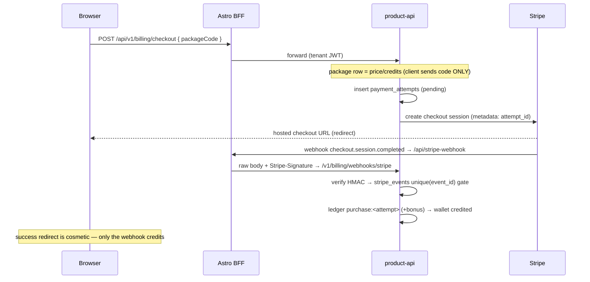
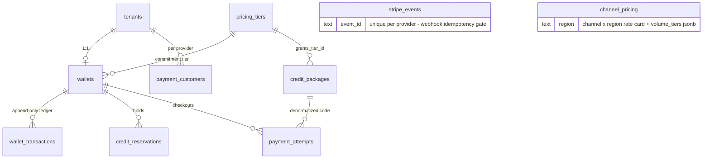

# Billing architecture — wallet, ledger, pricing

**Package:** `workers/packages/billing` · **Routes:** `apps/product-api/src/routes/billing.ts` + `billing-webhooks.ts` · **Schema:** `packages/database/src/schema.ts` (billing section) + migration `0013_billing_wallet.sql`

Maildrill is pay-per-use: customers buy **prepaid credits** and consume them as
they send. Stripe processes payments; **Postgres is the source of truth** for
every balance, price, discount, and consumption. Stripe objects never cross the
domain boundary — the API returns Maildrill domain objects only.

## Division of responsibility

| Stripe (via `PaymentProvider`)      | Maildrill (`@maildrill/billing`)           |
| ----------------------------------- | ------------------------------------------ |
| Hosted checkout, payment processing | Wallet, balance, reservations              |
| Customer + payment methods, portal  | Credit packages, pricing rules, discounts  |
| Taxes, invoices, receipts           | Volume + commitment pricing, channel rates |
| Refund events, payment auth (3DS)   | Immutable ledger, consumption, reporting   |

The provider is an interface (`src/provider/types.ts`). Adding Paddle/Adyen/
MercadoPago later = one new adapter + a `registry.ts` entry; the domain never
changes. The Stripe adapter (`provider/stripe.ts`) is a hand-rolled `fetch`
client — same style as the Infobip/Cloudflare messaging providers — using four
endpoints (customers, checkout sessions, portal sessions, invoices) plus
webhook signature verification (HMAC-SHA256 `t/v1` scheme, 5-minute tolerance,
timing-safe compare).

## Money model

Credits are **integer micro-USD** (`1 USD = 1_000_000 micro`) so sub-cent unit
prices ($0.0005/email = 500 micro) stay exact. Floats appear only at display
boundaries. Purchases are charged in cents (`price_cents`) — Stripe's unit.

## Wallet + ledger

One wallet per workspace (`wallets`, unique `tenant_id`) — users never own
balances. The wallet row is a **cached projection**; truth is the append-only
`wallet_transactions` ledger. Every mutation flows through
`appendLedgerEntry` (`src/ledger.ts`), which — inside one transaction —

1. short-circuits on the idempotency key (replays return the original row),
2. `SELECT … FOR UPDATE`s the wallet row,
3. validates the entry sign (`purchase|promotion|bonus` +, `consumption|refund` −,
   `adjustment|correction` either) and refuses overdrafts (unless the entry
   explicitly allows negative — refund clawbacks, manual corrections),
4. inserts the immutable ledger row with a `balance_after_micro` snapshot,
5. updates the wallet projection (`balance_micro`, `reserved_micro`, `version`).

**Invariant:** `balance + reserved = SUM(ledger.amount)`. `reconcileWallet`
(exposed at `GET /v1/billing/reconciliation`) audits it; drift is logged as an
error, never auto-fixed. Ledger rows are never updated or deleted — mistakes
are corrected by new `correction` entries.

## Reservations (reserve → commit → release)

`credit_reservations` are **holds, not ledger events**: reserving moves credits
`balance → reserved` with no ledger entry; only a commit writes `consumption`.

```mermaid
sequenceDiagram
  participant UI as Campaign send
  participant P as product/campaigns
  participant B as billing
  participant W as dispatch/poller
  UI->>P: send campaign
  P->>B: reserveCampaignCredits(estimate = recipients × rate)
  alt insufficient credits
    B-->>P: ConflictError(insufficient_credits)
    P-->>UI: 409 — draft restored, nothing sent
  end
  P->>W: submit messages (outbox → BullMQ → provider)
  W->>B: chargeMessageDelivered (per delivered/sent, key consume:<messageId>)
  Note over B: consumes from the hold; falls back to direct debit
  W->>B: settleCampaignReservation (campaign complete)
  Note over B: remainder returns reserved → balance
```

- Reservation per business reference (`campaign:<id>`), idempotent — retried
  sends reuse the hold.
- Commits are keyed `consume:<messageId>` — BullMQ retries, duplicate DLRs, and
  the two outcome paths (provider webhook + PostHog poller) collapse to one entry.
- Terminal paths: campaign completion releases the remainder; the maintenance
  worker sweeps expired holds (`BILLING_RESERVATION_TTL_MINUTES`, default 120).
- **`BILLING_ENFORCEMENT=0` (default) makes every hook a no-op** — the
  messaging pipeline is byte-for-byte the pre-billing behavior until switched on.
- Billing failures never break delivery bookkeeping: charges are post-commit
  and logged, and drift is caught by reconciliation.

## Pricing engine

Pure functions (`src/pricing.ts`) over database rows — repricing is an INSERT:

- `channel_pricing` — per channel × region (`default` fallback): base micro
  price, unit (`message`/`minute`/`conversation`), min billable units, billing
  precision, provider cost + margin (internal reporting only), and a
  `volume_tiers` jsonb ladder `[{ minUnits, priceMicro }]`.
- `pricing_tiers` — commitment levels (pay-as-you-go, Starter, Growth, Scale…)
  with `discount_bps`, min purchase, commitment months. A wallet points at its
  tier; commitment packages set it on purchase.
- Resolution order: region row (or `default`) → highest volume step ≤ units →
  tier discount in bps → min-billable floor. `quotePrice` returns the full
  quote (base, effective, total, flags) so APIs and enforcement agree.

`credit_packages` define what checkout sells: price cents, credits, bonus
credits, optional `grants_tier_id`. Seeded from the marketing rate card by
`pnpm --dir workers db:seed:billing` (`packages/database/src/seed-billing.ts`)
— tiers 0/10/20/30 % match `src/config/pricing.ts` `TIERS`; channel rates match
`EMAIL_RATE` + `REGION_TIERS`.

## Purchase flow



Idempotency is two independent layers: the `stripe_events` unique event id
(skips redelivered events) and ledger keys (`purchase:<attempt>`), so even two
_different_ events for the same payment (checkout.session.completed +
payment_intent.succeeded) grant once. Unexpected processing errors roll back
the whole transaction (including the event row) and answer 5xx so Stripe
redelivers; permanent impossibilities record `skipped` and answer 2xx.

Refunds (`charge.refunded`) claw back credits proportional to the refunded
amount, capped at the grant, `refund:<chargeId>`-keyed, and may push a balance
negative — the ledger records reality.

## ER overview



## API surface (`/v1/billing/*`, tenant from JWT, all domain-shaped)

| Route                   | What                                           | Access                    |
| ----------------------- | ---------------------------------------------- | ------------------------- |
| `GET /wallet`           | balance/reserved/low-balance/tier              | any member                |
| `GET /transactions`     | ledger, keyset-paginated newest-first          | any member                |
| `GET /packages`         | active packages + effective economics          | any member                |
| `GET /pricing`          | effective per-channel rates for this workspace | any member                |
| `GET /tier`             | current + available commitment levels          | any member                |
| `POST /checkout`        | `{ packageCode }` → hosted checkout URL        | owner/admin, rate-limited |
| `POST /portal`          | hosted customer portal URL                     | owner/admin, rate-limited |
| `GET /invoices`         | domain-mapped invoices                         | any member                |
| `GET /reconciliation`   | ledger-vs-wallet audit                         | owner/admin               |
| `POST /webhooks/stripe` | signature-authenticated intake                 | public (HMAC)             |

Frontend: the Settings → Usage/Billing panels (`AppSettings.tsx`) read
`/api/v1/billing/*` through the generic BFF proxy; `AddBalanceModal` sends a
package code and redirects to the returned URL. The public webhook enters at
`src/pages/api/stripe-webhook.ts` (raw-body passthrough).

## Performance posture

- Ledger writes are append-only; the hot row is the wallet (`FOR UPDATE`), one
  short transaction per financial event.
- Reads are keyset-paginated on `(tenant_id, created_at)` — no OFFSET at
  millions of rows.
- Balance is O(1) from the projection; the ledger SUM runs only in
  reconciliation/audit.
- `wallets.version` increments on every mutation — a cheap cache-staleness
  signal for future read replicas; reporting can run off the immutable ledger
  without touching transactional paths.

## Testing

- Pure units (default suite): `money`, `pricing`, `ledger` sign rules, Stripe
  form encoding / signature / event normalization / API client (fetch-stubbed).
- `billing.e2e.test.ts` (`RUN_E2E=1`, real Postgres): purchase idempotency
  across duplicate + sibling webhooks, payment failure, reserve→commit→release
  invariant, concurrent wallet creation and debits, refund clawback, overdraft
  rejection + override, reconciliation, ledger paging.
